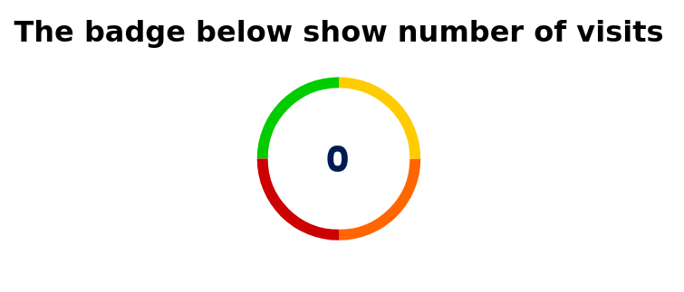

# Visits counter
This is a demo project which shows how to make a counter for github profiles. If you go on my profile [@rathod-sahaab](https://github.com/rathod-sahab) you can see a counter which counts how many time the profile was viewed.

This project demonstrates how to make something similar to that.

Screenshot:


## Documentation
The project is explained in thoroughly on my blog post about [visits counter](https://rathod-sahaab.github.io/blog/posts/visits-counter).

## Building
Install dependencies
```
yarn
```

run server
```
yarn develop
```
